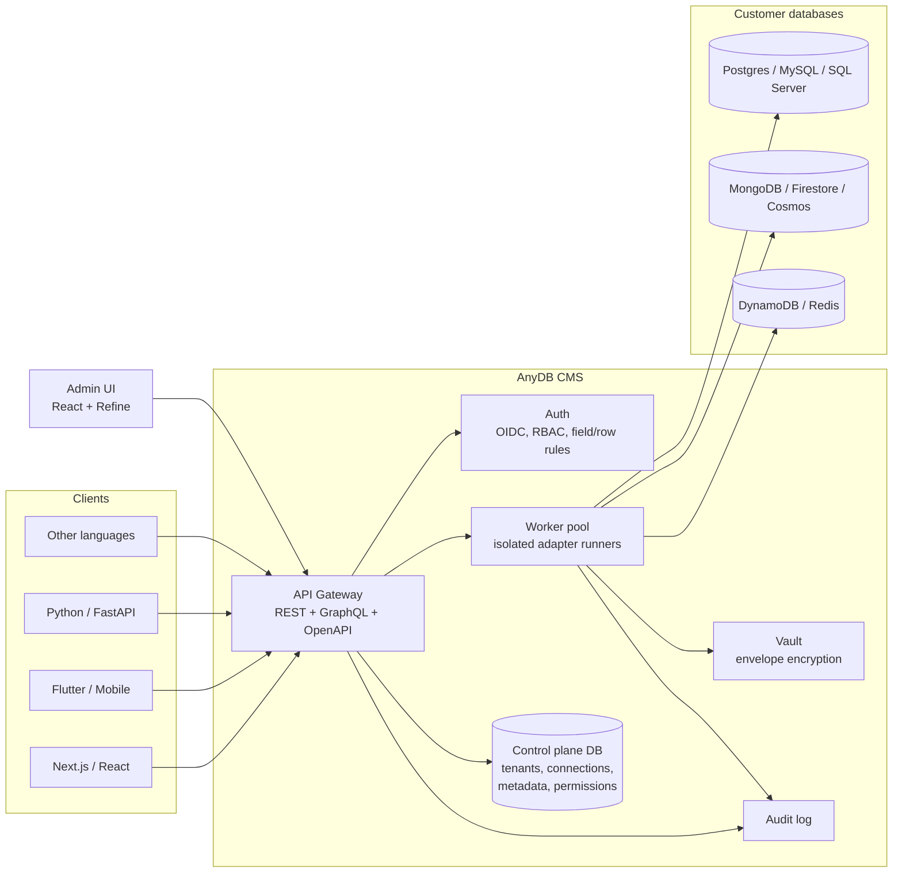
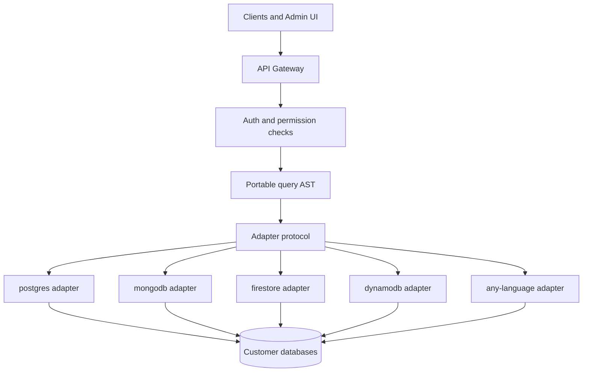
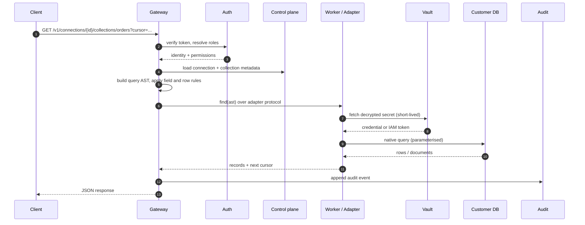
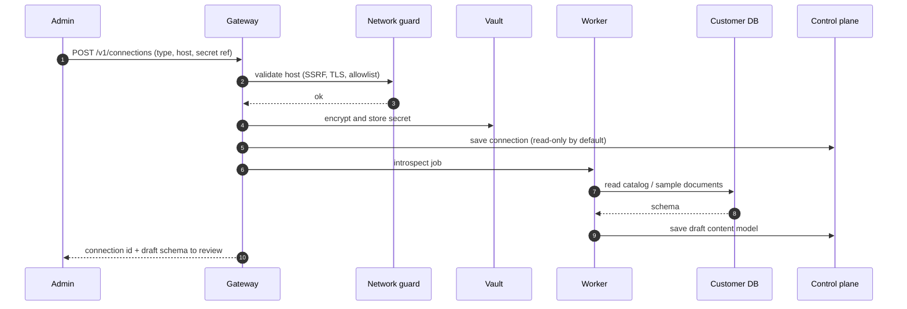
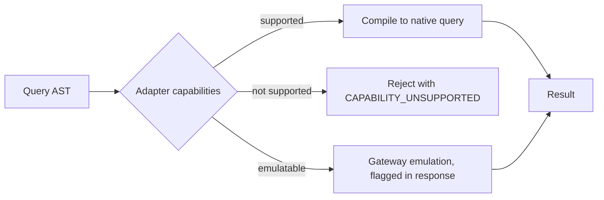
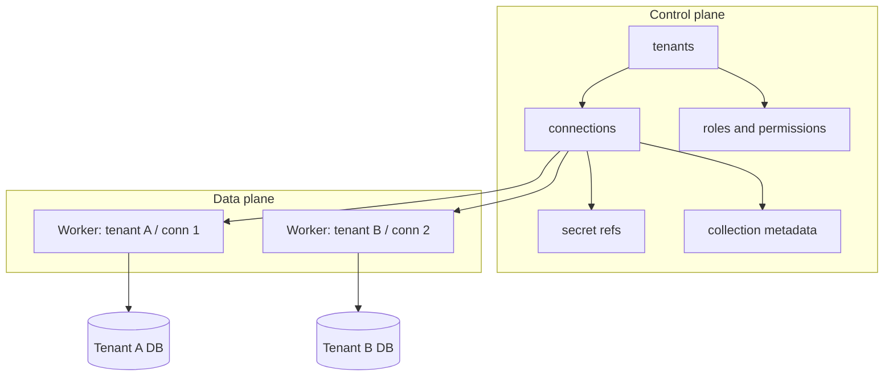
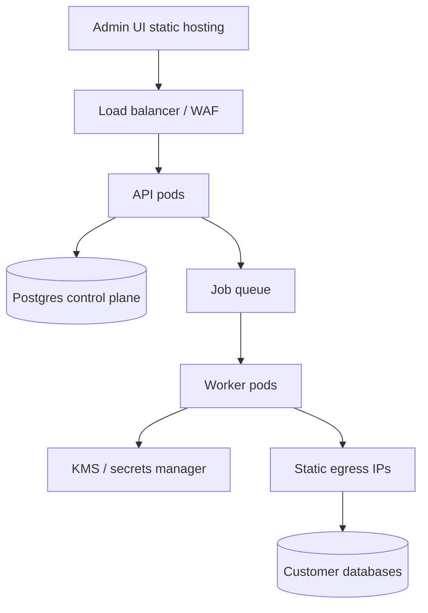

# 4. Architecture

## 4.1 System context

## 4.2 Layers

## 4.3 Read request flow

## 4.4 Connect-and-introspect flow

## 4.5 Adapter capability handling

Examples: DynamoDB has no arbitrary sort, so sorting by any column is rejected; Firestore has limited OR and inequality, so some filters are rejected or emulated and marked as such.

## 4.6 Multi-tenant bring-your-own-database

Each connection gets its own pool limits and an isolated worker so one tenant's slow query cannot starve another.

## 4.7 Deployment view

Static egress IPs let customers allowlist the platform. Private networking (PrivateLink, Private Service Connect, Private Link) and SSH tunnels are supported alongside.
