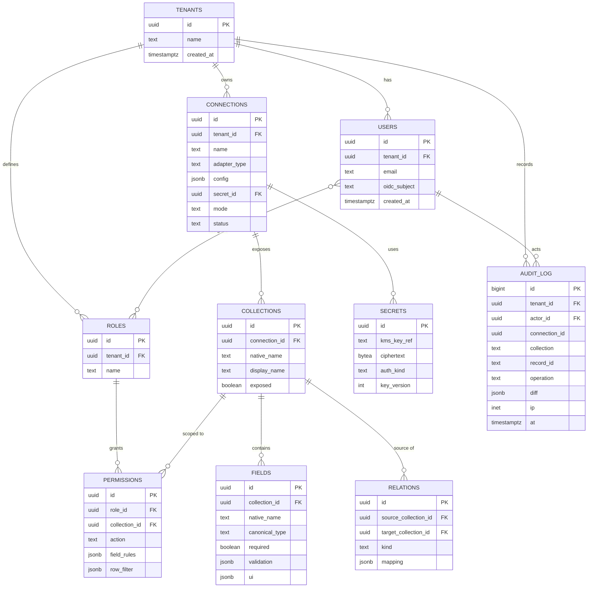
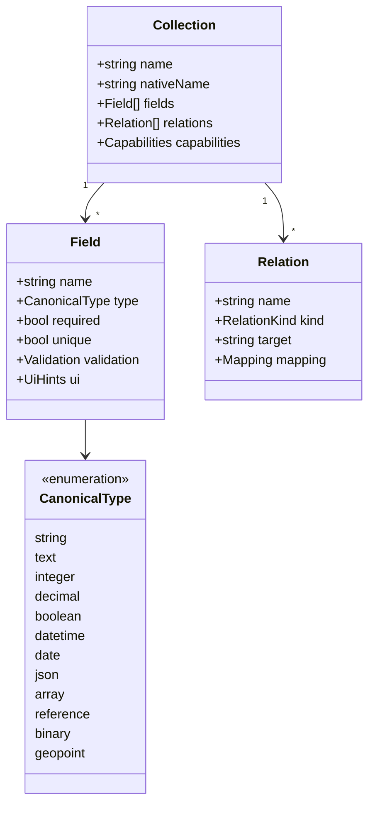
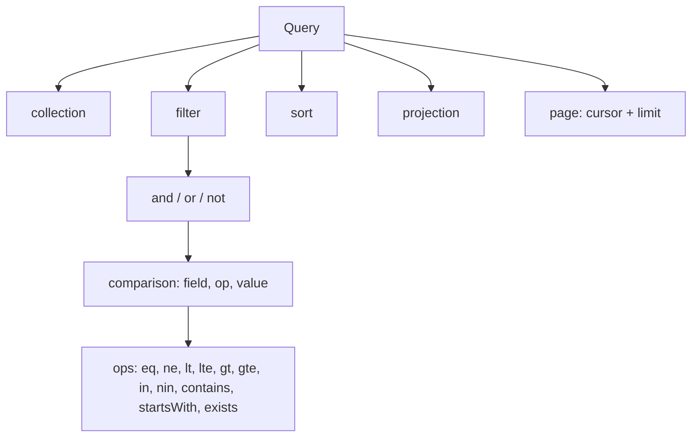

# 6. Data model and schemas

Two models exist. Do not mix them.

1. **Control plane**: the platform's own database (tenants, connections, metadata, permissions, audit). Always Postgres.
2. **Canonical content model**: the platform's description of a customer's data, stored in the control plane but never inside the customer's database.

## 6.1 Control-plane ER diagram



The full DDL is in [`schemas/control-plane.sql`](../schemas/control-plane.sql).

## 6.2 Canonical content model



## 6.3 Type mapping (canonical to native)

| Canonical | Postgres | MySQL | MongoDB | Firestore | DynamoDB |
|---|---|---|---|---|---|
| string | varchar/text | varchar | string | string | S |
| integer | int/bigint | int/bigint | int32/int64 | integer | N |
| decimal | numeric | decimal | decimal128 | double | N |
| boolean | boolean | tinyint(1) | bool | boolean | BOOL |
| datetime | timestamptz | datetime | date | timestamp | S (ISO) or N |
| json | jsonb | json | object | map | M |
| array | array / jsonb | json | array | array | L |
| reference | FK | FK | ObjectId | document ref | key string |
| geopoint | geometry/point | point | GeoJSON | geopoint | M |

Adapters own the exact conversion in `type-map.ts`. Lossy conversions must be flagged in introspection.

## 6.4 Portable query AST



Example:

```json
{
  "collection": "orders",
  "filter": { "and": [
    { "field": "status", "op": "eq", "value": "paid" },
    { "field": "total", "op": "gte", "value": 100 }
  ]},
  "sort": [{ "field": "created_at", "dir": "desc" }],
  "projection": ["id", "status", "total", "created_at"],
  "page": { "limit": 50, "cursor": null }
}
```

The JSON Schema is in [`schemas/query-ast.schema.json`](../schemas/query-ast.schema.json). Field names are always validated against introspected metadata before compilation; they are never interpolated into native queries.

## 6.5 Rules

1. Metadata lives in the control plane, never in the customer's database.
2. Cursor pagination is the default everywhere.
3. Cross-source relations resolve at the gateway with batching, not inside any database.
4. Validation happens in the CMS layer for schemaless stores.
