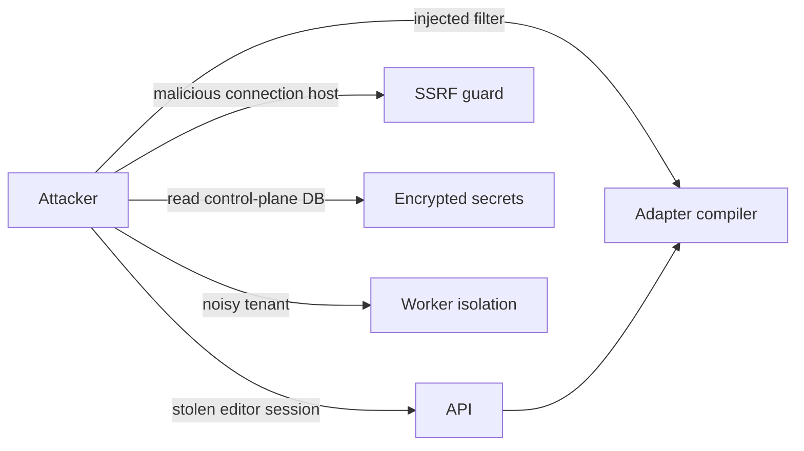

# 7. Security

Security drives the architecture. This page lists the controls the MVP must have.

## Threat model

| Threat | Control |
|---|---|
| Stolen credentials from the control plane | Envelope encryption, key held in KMS, not in the database |
| Credentials leaking to clients | Clients only call the API; secrets never leave `vault` |
| SSRF through "bring your own database" hosts | Block private ranges and metadata endpoints unless explicitly configured |
| Query injection | Parameterised queries, identifier allowlist from introspected metadata, operator allowlist |
| Over-broad database access | Dedicated least-privilege role, read-only by default |
| Cross-tenant impact | Isolated workers, per-connection pool and rate limits |
| Unaccountable changes | Append-only audit log outside tenant databases |

## Credentials

- Encrypt connection secrets with a data key wrapped by a KMS key (envelope encryption), with a documented rotation path.
- Back up the key separately from database backups. Losing it makes secrets unrecoverable.
- Prefer identity-based access over stored passwords:
  - AWS: IAM database auth, cross-account role with external ID, Secrets Manager ARN
  - Google: service accounts, Cloud SQL connector, IAM database auth
  - Azure: Entra ID tokens, managed identities (tokens expire, so the vault refreshes them)
- Never log secrets. Redact connection strings in errors.

## Least privilege

- Ask tenants for a dedicated CMS role scoped to the needed schemas or tables.
- Connections are **read-only by default**; write mode is an explicit opt-in.
- Firebase: the Admin SDK uses a service account with full access and is not gated by Security Rules. Scope the service account with IAM and enforce authorization in the CMS.
- Supabase: the service-role key bypasses row-level security. To enforce RLS, forward the editor's JWT or use a dedicated Postgres role instead.

## Network controls

- Require TLS (`verify-full` where supported); allow custom CA bundles.
- Publish static egress IPs so tenants can allowlist the platform.
- Support SSH tunnels and private networking (PrivateLink, Private Service Connect, Azure Private Link).
- Resolve and validate hostnames server-side; re-check after DNS resolution to avoid rebinding.

## Injection defence

- Compile the query AST to parameterised queries only.
- Allowlist table and column names against introspected metadata.
- MongoDB: reject operator injection (`$where`, `$function`, keys starting with `$` from user input).
- Firestore and DynamoDB: validate field paths.
- Raw-query features sit behind a separate permission and are always audited.

## Access control

- SSO/OIDC for editors, MFA for admins.
- RBAC at collection level, plus field rules (hide, mask, read-only) and row filters.
- Permission checks run in the gateway, independent of database grants (defence in depth).

## Audit

Append-only, stored in the control plane, never in tenant databases. Record: actor, tenant, connection, collection, record id, operation, before/after diff with sensitive fields redacted, IP, timestamp. Also log connection create/update, credential reads by workers, and permission changes.

## Security test suite

`tests/security/` must cover SQL and NoSQL injection, identifier allowlist bypass, SSRF (private IPs, metadata IPs, DNS rebinding), permission bypass (field and row rules), secret leakage in logs and errors, and cross-tenant access.

## Supply chain

Generate an SBOM in CI, pin dependencies, and run dependency scanning on every pull request.
