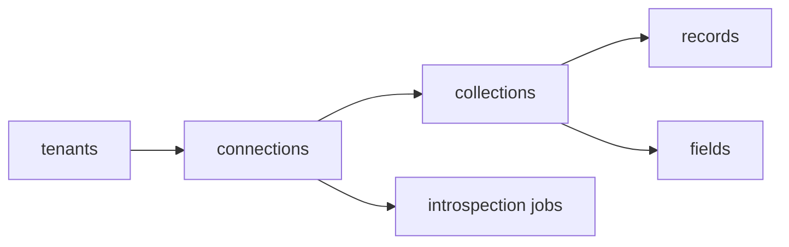

# 8. API

One contract for every client. REST is the primary surface; GraphQL is generated from the same content model; OpenAPI is the source for SDK generation.

## Resources



## REST endpoints (v1)

| Method | Path | Purpose |
|---|---|---|
| POST | `/v1/connections` | Create a connection (validated, read-only by default) |
| GET | `/v1/connections` | List connections |
| GET | `/v1/connections/{id}` | Connection detail and health |
| PATCH | `/v1/connections/{id}` | Update config, mode, secret reference |
| DELETE | `/v1/connections/{id}` | Remove connection and stored secret |
| POST | `/v1/connections/{id}/introspect` | Start an introspection job |
| GET | `/v1/connections/{id}/collections` | List collections and fields |
| PATCH | `/v1/collections/{id}` | Edit display name, field UI hints, exposure |
| GET | `/v1/connections/{id}/collections/{name}/records` | List records (filter, sort, cursor) |
| GET | `/v1/connections/{id}/collections/{name}/records/{rid}` | Get one record |
| POST | `/v1/connections/{id}/collections/{name}/records` | Create |
| PATCH | `/v1/connections/{id}/collections/{name}/records/{rid}` | Update |
| DELETE | `/v1/connections/{id}/collections/{name}/records/{rid}` | Delete |
| POST | `/v1/connections/{id}/batch` | Batch writes |
| GET | `/v1/audit` | Query the audit log |
| GET | `/v1/health` | Liveness and readiness |

Write endpoints return `READ_ONLY` on read-only connections.

## Listing records

```
GET /v1/connections/c1/collections/orders/records
    ?filter={"and":[{"field":"status","op":"eq","value":"paid"}]}
    &sort=-created_at
    &fields=id,status,total
    &limit=50
    &cursor=eyJ...
```

Response:

```json
{
  "data": [ { "id": "o_1", "status": "paid", "total": 120 } ],
  "page": { "nextCursor": "eyJ...", "limit": 50 },
  "meta": { "capabilityNotes": [] }
}
```

`capabilityNotes` lists emulated or degraded behaviour (for example "sort emulated at gateway").

## Pagination

Cursor-only. Cursors are opaque, signed and bound to the query, so a client cannot alter the filter between pages. Offset pagination is offered only where the adapter's `pagination.offset` flag is true.

## Errors

```json
{
  "error": {
    "code": "CAPABILITY_UNSUPPORTED",
    "message": "Sorting by 'total' is not supported on this connection",
    "details": { "adapter": "dynamodb", "field": "total" },
    "requestId": "req_8f2a"
  }
}
```

| Code | HTTP |
|---|---|
| `VALIDATION_FAILED` | 400 |
| `AUTH_FAILED` | 401 |
| `FORBIDDEN` | 403 |
| `NOT_FOUND` | 404 |
| `CONFLICT` | 409 |
| `CAPABILITY_UNSUPPORTED` | 422 |
| `READ_ONLY` | 403 |
| `RATE_LIMITED` | 429 |
| `CONNECTION_FAILED` | 502 |
| `TIMEOUT` | 504 |
| `INTERNAL` | 500 |

## GraphQL

Generated per tenant from the content model: one type per collection, connections for paginated lists, and the same permission checks as REST. Cross-source relations resolve at the gateway with batching.

## Authentication

Bearer token from the OIDC provider. Service tokens for server-to-server use are scoped to a tenant and a role, are rotatable, and are never accepted from browsers.

## Rate limits and idempotency

- Per-tenant and per-connection rate limits.
- Writes accept an `Idempotency-Key` header.

## Versioning

Path-versioned (`/v1`). Breaking changes ship as `/v2`; additive changes do not bump the version.
