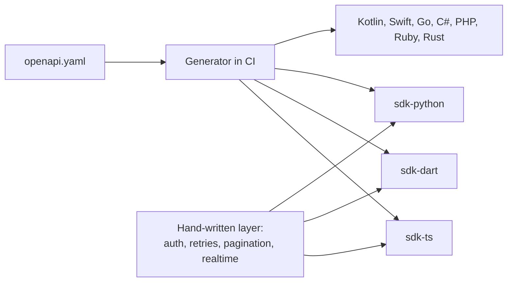

# 9. SDKs

Every client stack uses the same API. SDKs are generated from `openapi.yaml` so they never drift, with a small hand-written layer for ergonomics.



## Language matrix

| Language | Package | Approach |
|---|---|---|
| TypeScript / JavaScript | `@sethucms/sdk` | Hand-tuned, first class |
| Dart / Flutter | `sethucms` (pub.dev) | Generated models + hand-written client |
| Python | `sethucms` (PyPI) | Generated models + hand-written client |
| Kotlin / Java | generated | Android and JVM |
| Swift | generated | iOS |
| Go, C#, PHP, Ruby, Rust | generated | On demand |

Check package names on npm, pub.dev and PyPI before committing to them.

## Hand-written layer

Each first-party SDK adds the same small set of behaviours:

| File | Purpose |
|---|---|
| `client` | Base URL, token, request pipeline |
| `auth` | Token refresh |
| `query_builder` | Build filters and sorts in the language's idiom |
| `pagination` | Async iterator over cursors |
| `realtime` | Optional subscription helper |
| `errors` | Typed error classes from the API error codes |

## Dart example (shape only)

```dart
final client = SethuClient(baseUrl: url, token: token);
final page = await client
    .collection('c1', 'orders')
    .where('status', eq: 'paid')
    .orderBy('created_at', desc: true)
    .limit(50)
    .list();
```

## Python example (shape only)

```python
client = SethuClient(base_url=url, token=token)
for order in client.collection("c1", "orders").where("status", "eq", "paid").iterate():
    print(order["id"])
```

## Rules

1. SDKs never hold database credentials. They only hold API tokens.
2. Browser and mobile SDKs use short-lived user tokens, never service tokens.
3. CI regenerates SDKs on every API release and fails if generated code is out of date.
4. Semantic versioning follows the API version.
