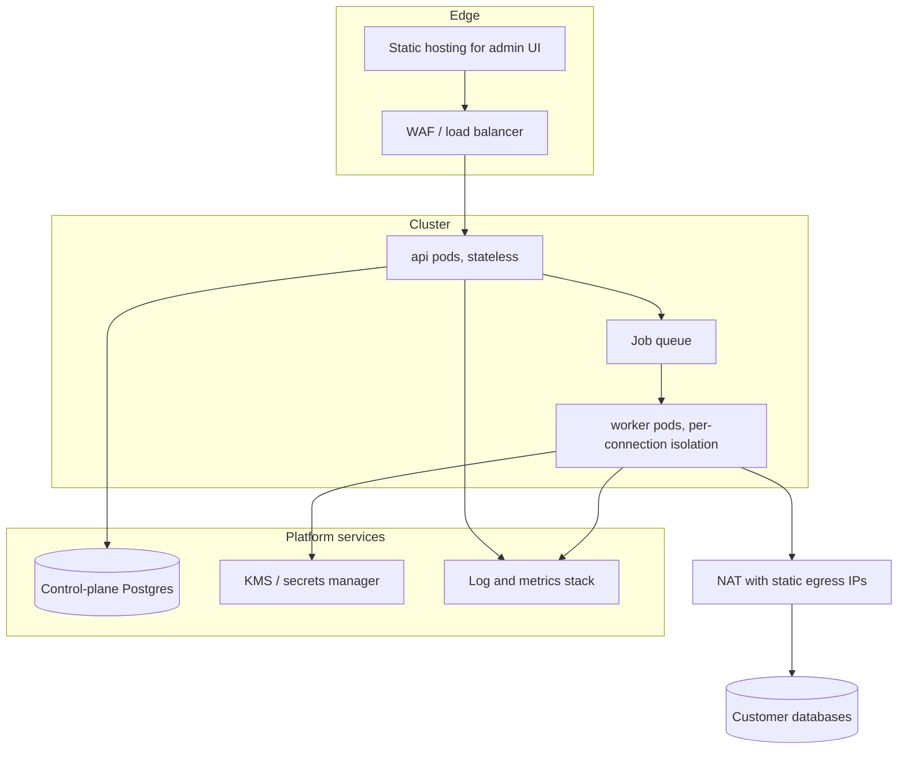

# 10. Deployment

> **Built today:** a single container that runs the gateway and serves the admin app on one port, with its state in one volume. How to build, run and operate it is in [15. Deploy to production](15-deploy-production.md). This page describes the larger target design (separate api and worker pods, queue, managed control-plane database). The worker, queue and shared control-plane database are not built yet, and the Kubernetes and Terraform files in `sethucms-infra` follow that larger design.

## Environments

| Environment | Purpose |
|---|---|
| Local | `docker compose up`: api, worker, admin, control-plane Postgres, test databases |
| Staging | Full stack, synthetic tenant data |
| Production | Kubernetes, managed Postgres for the control plane, KMS-backed secrets |

## Runtime topology

## Services

| Service | Scaling | Notes |
|---|---|---|
| api | Horizontal, stateless | Never connects to customer databases directly |
| worker | Horizontal, per-connection pool caps | Only component that decrypts secrets |
| admin | Static assets | Talks only to api |
| control-plane DB | Managed Postgres | Backups, point-in-time recovery |
| queue | Managed | Introspection jobs, realtime fan-out |

## Cloud identity and networking

| Cloud | Identity (no stored passwords where possible) | Private networking |
|---|---|---|
| AWS | IAM database auth, cross-account role with external ID, Secrets Manager ARN | PrivateLink, VPC peering |
| Google Cloud | Service accounts, Cloud SQL connector, IAM database auth | Private Service Connect |
| Azure | Entra ID tokens, managed identities (refreshed by the vault) | Private Link |
| Any | Passwords in the vault, SSH tunnels | Static egress IPs for allowlisting |

## Configuration

Environment variables (names only; never commit values):

`DATABASE_URL`, `KMS_KEY_REF`, `OIDC_ISSUER`, `OIDC_CLIENT_ID`, `SESSION_SECRET_REF`, `EGRESS_BLOCKLIST_EXTRA`, `WORKER_MAX_POOL_PER_CONNECTION`, `LOG_LEVEL`.

Secrets come from a secrets manager, not from `.env` files in production.

## Observability

- Structured logs with request ids; secrets redacted at the logger.
- Metrics per connection: latency, errors, pool usage, rate-limit hits.
- Alerts on failed introspection, credential refresh failures, and unusual audit patterns.

## CI/CD

Each repository has its own GitHub Actions workflows (see the CI/CD section of the PDF, and `sethucms/ci-workflows/`). A tag such as `v0.1.0` builds and publishes the container image. The target pipeline is:

1. Lint, type-check, unit tests
2. Conformance suite per adapter (against containerised databases)
3. Security suite (injection, SSRF, permission bypass)
4. Build images, generate SBOM, scan dependencies
5. Regenerate SDKs from OpenAPI; fail on drift
6. Deploy to staging, run end-to-end tests, promote

## Backup and recovery

- Control plane: automated backups and point-in-time recovery.
- The KMS key is backed up separately. Without it, stored secrets cannot be decrypted even from an intact backup.
- Document a key-rotation drill and run it before launch.
