# 11. Roadmap

Estimates assume one or two engineers and are rough planning guesses, not benchmarks.

## Where we are (October 2026)

| Phase | State |
|---|---|
| 1. Foundation | Done: core (29 tests), adapter contract and test kit |
| 2. Security spine | Done: vault, token auth, audit log, network guard, rate limits, idempotency, single sign-on (OIDC, tested only against a fake identity provider) |
| 3. First path | Done: PostgreSQL adapter and gateway, tested against a live database |
| 4. More adapters | Done: memory, PostgreSQL, SQLite, MySQL/MariaDB (tested on real servers), MongoDB and Firestore (stand-ins only). Not started: SQL Server, DynamoDB |
| 5. Admin UI | Done for the first release: connections, content editing with drafts, publish, live preview, access, audit, settings |
| 6. SDKs | TypeScript SDK packaged as 0.1.0 (npm publish pending) and used by four example apps. Python and Dart written but never run. Python and Go adapter templates not yet aligned with the gRPC protocol |
| 7. Hardening | Not started: load tests, penetration review, key-rotation drill, cloud-identity connections |

Also done outside the original plan: CI/CD workflows for every repository, a one-image release build, and agent guides (`AGENTS.md`).

Next, in this order: publish 0.1.0 and open the repositories; run the container image, Compose file and deploy workflows end to end; run MongoDB and Firestore tests against real servers; native change capture from the databases; custom roles and webhook screens in the admin app; business and vendor dashboards; a `create-sethucms` starter and helper libraries for React and Angular.

```mermaid
gantt
    title SethuCMS MVP (weeks)
    dateFormat  X
    axisFormat  W%s
    section Foundation
    Root config, core, protocol, control-plane DB :0, 2
    section Security spine
    vault, auth, audit, network-guard :2, 4
    section First path
    postgres adapter + conformance + API :4, 6
    section Adapters
    mongodb, firestore, mysql, mssql, dynamodb :6, 10
    section Clients
    Admin UI :8, 12
    SDKs (TS, Dart, Python) :10, 12
    section Hardening
    Security tests, load tests, docs, cloud identity :12, 14
```

## Phases

| Phase | Goal | Exit criteria |
|---|---|---|
| 1. Foundation | Repo, core types, adapter protocol, control-plane schema | `core` builds; migrations apply cleanly |
| 2. Security spine | Vault, auth, audit, network guard | Secrets encrypted end to end; SSRF tests pass |
| 3. First path | Postgres adapter plus API, request to database | Conformance suite green on Postgres |
| 4. More adapters | MongoDB, Firestore, MySQL, SQL Server, DynamoDB | Each passes conformance and security suites |
| 5. Admin UI | Connect, introspect, edit, permissions | Editor can complete a full content edit via UI only |
| 6. SDKs | Generated Dart and Python, hand-tuned TS | Sample apps (Next.js, Flutter, FastAPI) run |
| 7. Hardening | Load, security review, docs, cloud identity | Penetration review done; key-rotation drill done |

## File counts (hand-written, MVP)

| Area | Files |
|---|---|
| Root config | ~12 |
| core | ~15 |
| protocol + adapter-sdk | ~13 |
| 6 adapters | ~36 |
| vault | ~8 |
| auth | ~10 |
| audit + network-guard | ~11 |
| api | ~25 |
| worker | ~12 |
| admin | ~40 |
| control-plane DB | ~10 |
| sdk-ts | ~8 |
| Dart SDK (hand-written) | ~8 |
| Python SDK (hand-written) | ~9 |
| Go + Python adapter templates | ~16 |
| infra | ~15 |
| tests | ~20 |
| CI + docs | ~20 |
| **Total** | **~290** |

The earlier rough estimate was 200-250; this table sums slightly higher once every area is counted. Treat both as ballpark.

## After the MVP

- Cosmos DB, Spanner, BigQuery, Redshift, Redis, Firebase RTDB
- Realtime subscriptions across adapters
- gRPC endpoint
- Third-party adapters in Go, Python and other languages
- Pricing and billing (per connection is the main cost driver)

## Risks

| Risk | Mitigation |
|---|---|
| Capability gaps make some databases feel second class | Honest capability flags; clear UI messaging |
| Credential handling mistakes | Security spine built before any adapter; key-rotation drill |
| Scope creep across databases | Ship six adapters; add others only on demand |
| Prisma or driver version changes (for example MongoDB support) | Avoid a single ORM for all stores; isolate drivers inside adapters |
| Licensing of embedded tools | Prefer MIT/Apache components; legal review before embedding source-available tools |
