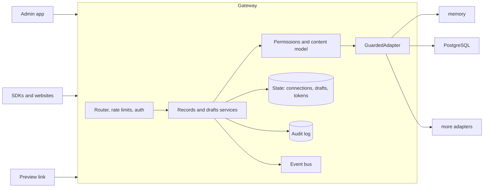
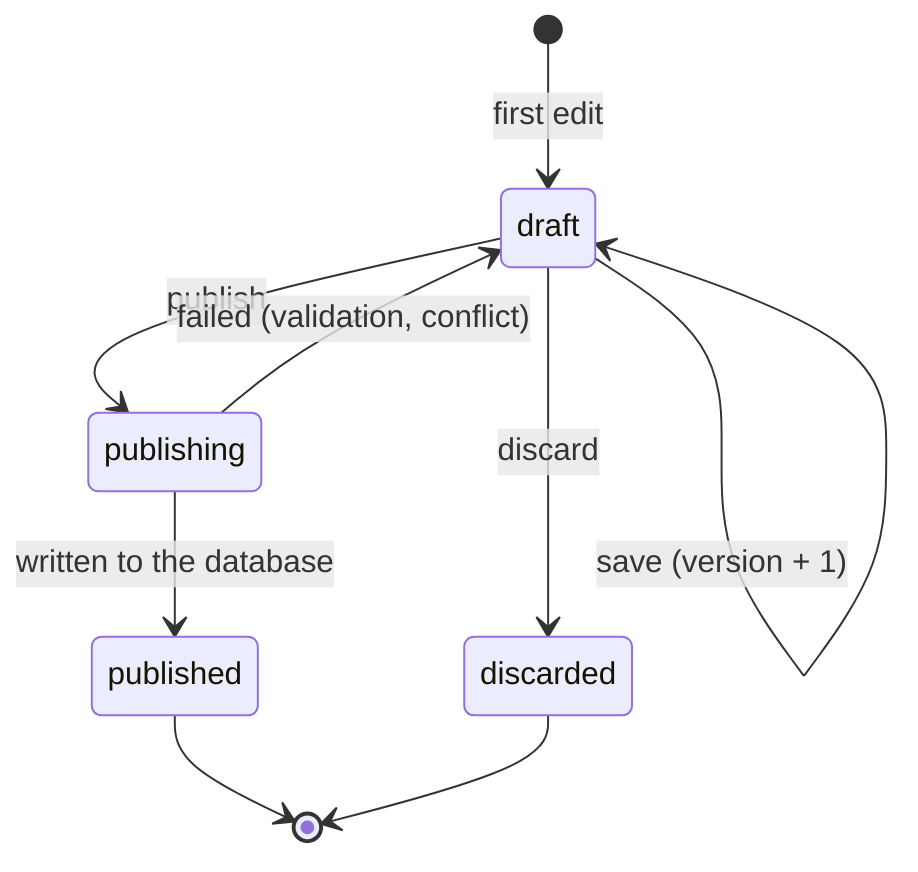

# 12. The gateway (`apps/api`)

The gateway is the one process that sits between every client (admin app, SDKs, websites) and every database.
It holds the credentials, applies permissions, keeps drafts, and writes the audit log. Clients never talk to a database.

## Request pipeline

1. Request id, CORS allow-list, URL and body size limits
2. Route lookup (404 unknown path, 405 wrong method)
3. Rate limit by address, then authenticate the token, then rate limit by token
4. For writes with an `Idempotency-Key`: replay the first answer if the key was seen
5. The route handler: permissions, then restricted query, then `GuardedAdapter`, then mask the answer
6. Audit and announce the change
7. Any failure becomes the standard error body (database text never leaves the server)

## Many databases at once

A connection is a saved row (name, adapter type, mode, settings, encrypted credentials, exposed collections). The registry opens
an adapter for a connection the first time it is used and keeps it open. Each connection has its own adapter, pool,
capabilities and content model. New connections are read-only with every collection hidden until an admin turns collections on.

## Drafts

- Drafts live in the gateway's store, encrypted, never in the customer database.
- A save must carry the `version` it started from (`409` if stale).
- A draft for an existing record stores a fingerprint of that record. Publishing refuses with `409 record_changed` when the record
  differs, unless `force` is set.
- Publishing goes through the normal write path (permissions, validation, read-only check, audit).

## Live preview

A preview link is `base64url(claims).hmac`. Claims: draft id, the token that created it, expiry (15 minutes).
`GET /v1/preview/:token` returns the published record with the draft's fields applied, masked for the person who created the link.
`GET /v1/preview/:token/events` streams the same payload whenever the draft changes. If the creating token is revoked, the link stops working.

## Live events

`GET /v1/events` streams changes made through the gateway: record created, updated or deleted; draft created, updated, discarded or published;
connection changed. Events carry ids only. Subscribers only receive events for collections they may read.
Direct database changes made by other tools are not seen (change streams from the databases are future work).

## Settings and storage

See `apps/api/.env.example`. Secrets (vault key, cursor secret, preview secret) are required in production and generated into the data
folder for local use. State is one JSON file written atomically with owner-only permissions: right for one process. For several
gateways, implement `StateStore` on a shared database and move rate limits and idempotency keys to a shared store.

## What is not built yet

Single sign-on (OIDC), per-collection custom roles in the gateway (the core engine supports them), adapters beyond memory and
PostgreSQL, adapters in other languages over gRPC, change streams, the worker, and a shared state store for multiple gateways.
