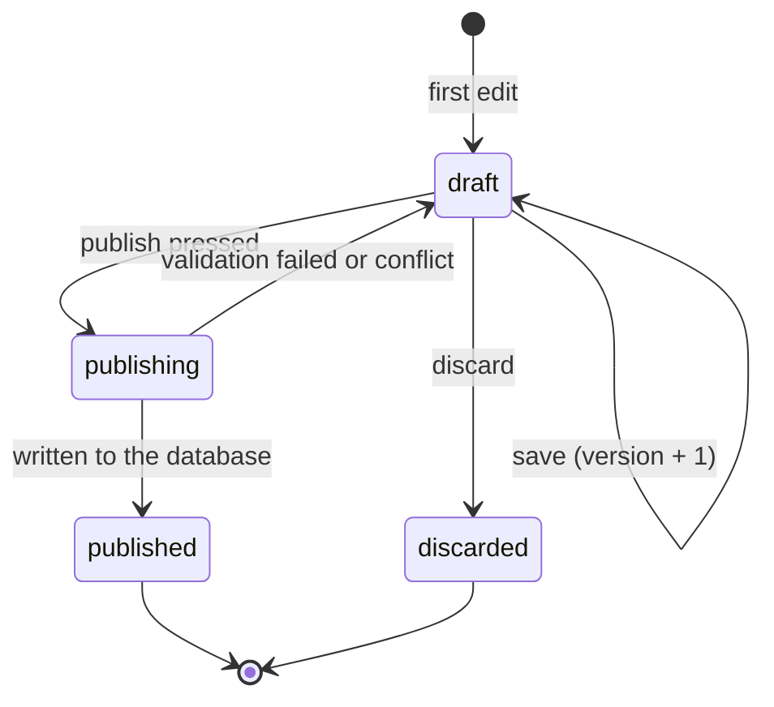
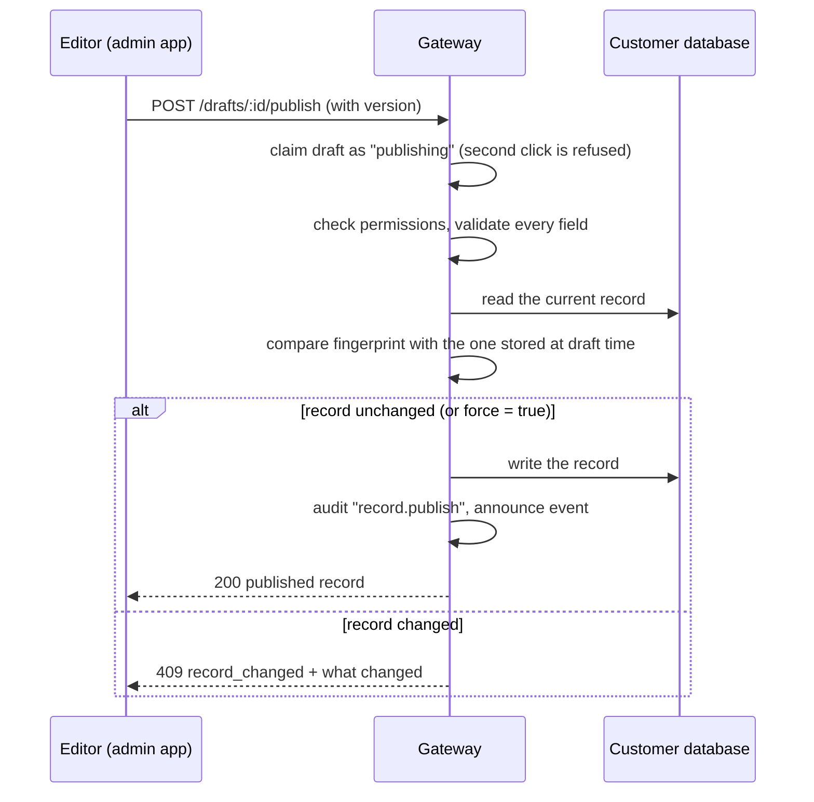
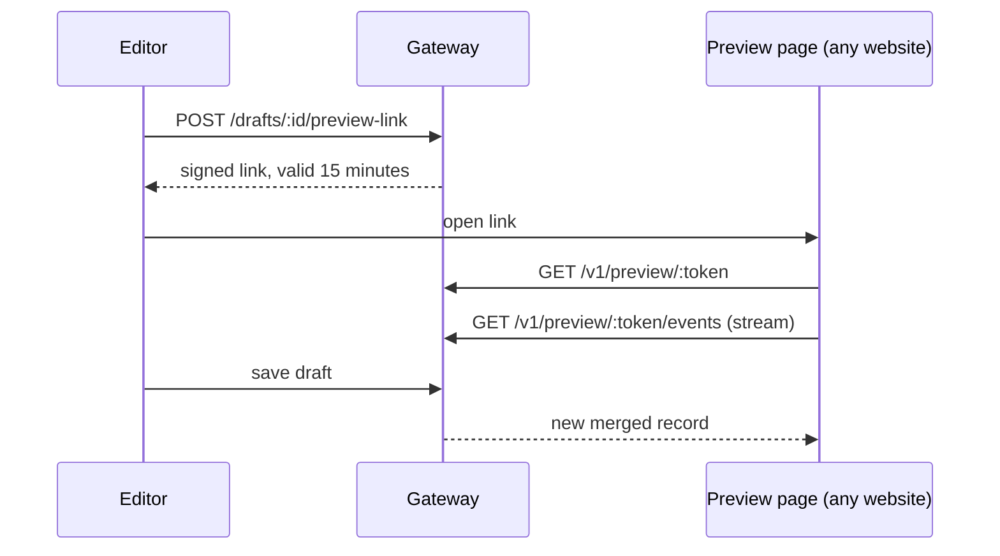

# 13. Drafts, publishing and live preview

This page explains how an edit travels from the editor's keyboard to the customer's database, and what protects it on the way.
It matches the code in `anydbcms/apps/api/src/content/drafts.ts` and `anydbcms-admin/src/components/RecordEditor.tsx`.

## The idea in one paragraph

Editing never touches the database. Every edit is saved as a **draft** inside the gateway. The database changes only when someone
presses **Publish**, and then it changes through the same checked write path as any other change.
This is why a half-finished edit can never appear on a live website, and why two people cannot silently overwrite each other.

## What the editor sees

| Step | In the admin app | What the gateway does |
| --- | --- | --- |
| Start typing | "Saving draft…" then "Draft saved" | Creates the draft (encrypted), version 1 |
| Keep typing | Saves about 0.7 seconds after the last key | Replaces the draft, version + 1 |
| Open preview | Preview pane updates as you type | Streams the draft merged over the published record |
| Publish | "Published" | Validates, checks for conflicts, writes to the database, deletes the draft |
| Discard | Draft disappears | Marks the draft discarded; the database is untouched |
| Someone else changed the record | Conflict panel with two choices | Refuses with `409 record_changed` |

## Draft life cycle

## Publish, step by step

## Three protections

1. **Version check.** A save must say which version it started from. If another tab saved in between, the answer is `409` and nothing is lost.
2. **Fingerprint check.** A draft of an existing record remembers a hash of that record. If the database row changed since
   (by another editor or by a direct database change), publish stops and shows the difference. The editor can reload the new
   record or choose **Publish anyway** (`force: true`, recorded in the audit log).
3. **Claim before write.** Publishing first moves the draft to `publishing`. A double click or a retry cannot write twice.

## Where drafts are stored

Drafts live in the gateway's state store, **not** in the customer's database. Each draft is encrypted with AES-256-GCM, bound to its own
id so it cannot be copied onto another draft. This means:

- Read-only connections can still have drafts (nothing is written until publish, and publish is refused on read-only connections).
- Deleting the gateway's data folder deletes all unpublished drafts. Published content is safe in the customer's database.

## Live preview

- The link is `base64url(claims).hmac-sha256`. It names the draft and the token that created it, and expires after 15 minutes.
- The preview shows what the creator is allowed to see: hidden fields stay masked.
- If the creating token is revoked, the link stops working at once.
- Preview links cannot publish, list other records or read other drafts.

## Rules to remember

- Only fields in the content model can be saved. An unknown field returns `400`, not a silent drop.
- Required-field errors are shown at publish time, not while drafting, so a half-written entry can always be saved.
- A draft belongs to one connection, one collection and (for edits) one record.
- Viewers can read published content, editors can draft and publish, admins can also manage connections and tokens.

## API summary

| Method and path | Purpose |
| --- | --- |
| `POST /v1/connections/:c/collections/:n/drafts` | Create a draft (new record or edit of an existing one) |
| `GET /v1/connections/:c/collections/:n/drafts` | List drafts |
| `PATCH .../drafts/:id` | Save a draft (send `version`) |
| `DELETE .../drafts/:id` | Discard |
| `POST .../drafts/:id/publish` | Publish (`{ "version": n, "force": false }`) |
| `POST .../drafts/:id/preview-link` | Create a preview link |
| `GET /v1/preview/:token` and `/events` | Read the preview, then stream updates |

## Tested

The gateway tests cover create, autosave, stale version, publish, double publish, conflict, force publish, discard, permissions,
read-only connections, preview tokens and the preview stream. The live PostgreSQL test also changes a row directly in the database
between draft and publish and checks that the conflict is caught.
