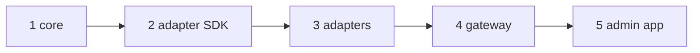

# 14. Build and run on your own machine

This is the complete path from empty folders to a working CMS with the admin app, the gateway and your databases.

## What you need

- Node.js 20 or newer and pnpm (`npm i -g pnpm`)
- The repositories cloned side by side in one folder:

```
~/sethucms               core + gateway (apps/api) + scripts
~/sethucms-adapter-sdk   what an adapter must implement
~/sethucms-adapters      memory and PostgreSQL adapters
~/sethucms-admin         the admin app (React)
```

Building the gateway from source still finds the other repositories by folder (`link:` dependencies), so the folder names above matter. If you only want to call a running gateway from your own app, you do not need any of this: install `@sethucms/sdk` from npm (see page 25).

## Build

```sh
cd ~/sethucms
sh scripts/build-all.sh
```

The script runs five steps in order and stops at the first problem:



Step 5 builds the admin app in *embedded* mode, so it calls the same address it was loaded from. No second server is needed.

## Run

```sh
sh scripts/run-local.sh
```

Open http://127.0.0.1:8080. On the first start the terminal prints an admin token **once**. Paste it into the sign-in page.
To choose your own token, set `SETHUCMS_ADMIN_TOKEN` (32 to 200 characters) before starting.

The first start also creates `.sethucms-data/` with `secrets.json` (owner-only), saved connections, drafts, tokens and the audit log.
Back this folder up; do not commit it (it is already in `.gitignore`).

## Connect your own database

1. Open **Connections**, then **Add connection**.
2. Pick PostgreSQL and fill host, port, database, user, password. Use a database user with the least rights you can.
3. Open the connection. It is **read-only** and every table is **hidden**.
4. Expose the tables you want, then (if you want editing) switch the connection to read-write.
5. Open **Content**, choose the connection and table, and edit. Drafts, preview and Publish work as described in page 13.

You can add as many connections as you like. They run at the same time, for example the demo in-memory data, a local PostgreSQL and a cloud PostgreSQL.

## Run the tests

```sh
cd ~/sethucms && pnpm --filter @sethucms/core test          # 29 tests
cd ~/sethucms/apps/api && pnpm test                         # 52 gateway tests
cd ~/sethucms-admin && pnpm exec tsc --noEmit               # type check
```

Optional live PostgreSQL test (needs a throw-away database):

```sh
docker run -d --name pgtest -e POSTGRES_PASSWORD=test -p 55432:5432 postgres:16
SETHUCMS_TEST_PG_HOST=127.0.0.1 SETHUCMS_TEST_PG_PORT=55432 \
SETHUCMS_TEST_PG_USER=postgres SETHUCMS_TEST_PG_PASSWORD=test \
SETHUCMS_TEST_PG_DB=postgres pnpm test
```

## Develop the admin app with hot reload

```sh
cd ~/sethucms/apps/api && node dist/src/main.js          # gateway on :8080
cd ~/sethucms-admin && cp .env.example .env              # VITE_API_URL=http://127.0.0.1:8080
pnpm dev                                                 # admin on :5173
```

Add `SETHUCMS_ALLOWED_ORIGINS=http://localhost:5173` to the gateway so the browser may call it. With `VITE_API_URL` empty the admin
shows built-in sample data instead of a real gateway.

## Going to production

| Setting | Why |
| --- | --- |
| `NODE_ENV=production` | Refuses to start without secrets; turns off the demo and private networks |
| `SETHUCMS_VAULT_KEY`, `SETHUCMS_CURSOR_SECRET`, `SETHUCMS_PREVIEW_SECRET` | `openssl rand -base64 32` each; keep in a secret manager |
| `SETHUCMS_ADMIN_TOKEN` | Your first admin; make more tokens in **Access**, then rotate this one |
| `SETHUCMS_ALLOWED_ORIGINS` | Only the sites that may call the API |
| `SETHUCMS_TRUST_PROXY=true` | Only behind a proxy you control |
| TLS | Terminate HTTPS in front of the gateway (load balancer or reverse proxy) |

Limits to plan around: one gateway process per data folder (state is a file, rate limits are per process), three fixed roles,
no single sign-on yet, and events only for changes made through the gateway. Page 12 lists them and the planned fixes.

## Troubleshooting

| Message | Cause and fix |
| --- | --- |
| `pnpm: command not found` | `npm i -g pnpm` |
| "Missing .../sethucms-adapters" | Clone the sibling repos next to `sethucms` |
| `Cannot find module '@sethucms/...'` | Run `sh scripts/build-all.sh` again; steps must run in order |
| Sign-in says token rejected | Use the token printed on first start, or set `SETHUCMS_ADMIN_TOKEN` and restart |
| Connection refused for a database | Private addresses are blocked in production; set `SETHUCMS_ALLOW_PRIVATE_NETWORKS=true` if intended |
| Fonts look wrong | Rebuild the admin app; fonts are bundled, not loaded from the internet |
