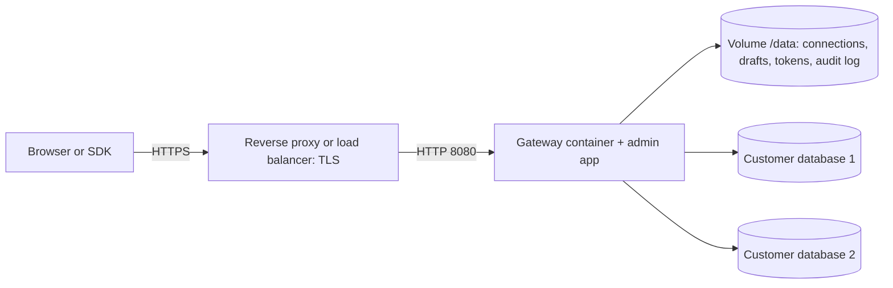

# 15. Deploy to production

This page is the checklist for running the gateway and admin app for real use. It is written for people and for coding agents.

**Status:** the steps below follow the code and the Dockerfile as written. The gateway, its secrets handling and its production checks are tested. The container image, the compose and Kubernetes files and the GitHub workflows have **not** been run end to end yet, so do the "Verify" steps before trusting any of them.

## What you deploy

One container. It runs the gateway and serves the built admin app from the same address, so there is one port (8080), one URL and no extra CORS setup.



## 1. Build the image

Needs the four repositories side by side (`anydbcms`, `anydbcms-adapter-sdk`, `anydbcms-adapters`, `anydbcms-admin`).

```sh
cd ~          # the folder that holds them
docker build -f anydbcms/docker/Dockerfile.gateway -t anydbcms .
```

Or let GitHub build it: push a tag such as `v0.1.0` to the `anydbcms` repository. The release workflow pushes `ghcr.io/<owner>/anydbcms:<version>`.

## 2. Create the secrets

Make each one once and keep them in a secrets manager (not in git, not in chat):

```sh
openssl rand -base64 32    # ANYDBCMS_VAULT_KEY
openssl rand -base64 32    # ANYDBCMS_CURSOR_SECRET
openssl rand -base64 32    # ANYDBCMS_PREVIEW_SECRET
openssl rand -hex 32       # ANYDBCMS_ADMIN_TOKEN (your first administrator)
```

**Back up the vault key separately.** Without it, saved database passwords and drafts cannot be decrypted, even from an intact backup. Changing it makes existing connections unreadable.

## 3. Run it

```sh
docker run -d --name anydbcms --restart unless-stopped \
  -p 127.0.0.1:8080:8080 \
  -v anydbcms-data:/data \
  -e ANYDBCMS_VAULT_KEY=... -e ANYDBCMS_CURSOR_SECRET=... \
  -e ANYDBCMS_PREVIEW_SECRET=... -e ANYDBCMS_ADMIN_TOKEN=... \
  -e ANYDBCMS_TRUST_PROXY=true \
  anydbcms
```

In production mode the gateway refuses to start if any secret is missing, turns off the demo connection and, by default, private-network database access. Set `ANYDBCMS_ALLOW_PRIVATE_NETWORKS=true` only if your databases really are on a private network you control. Metadata addresses stay blocked either way.

Put a reverse proxy or load balancer in front for HTTPS. Set `ANYDBCMS_TRUST_PROXY=true` **only** when such a proxy is in front, and not otherwise (it makes the gateway believe `X-Forwarded-For`).

## 4. Settings reference

| Setting | Production value |
| --- | --- |
| `NODE_ENV` | `production` (set in the image) |
| `PORT` | `8080` |
| `ANYDBCMS_DATA_DIR` | `/data` (a persistent volume) |
| `ANYDBCMS_ADMIN_DIR` | `/w/anydbcms-admin/dist` (set in the image) |
| `ANYDBCMS_ALLOWED_ORIGINS` | Only needed if a site on another address calls the API |
| `ANYDBCMS_TRUST_PROXY` | `true` behind your proxy, otherwise leave off |
| `ANYDBCMS_ALLOW_PRIVATE_NETWORKS` | Off unless needed |

The full list with comments is in `apps/api/.env.example`.

## 5. Verify (do this every time)

```sh
curl -fsS https://your-host/v1/health     # {"status":"ok"}
curl -fsS https://your-host/v1/ready
```

Then sign in with the admin token, add a connection to a test database, expose one collection, create a draft, preview it and publish. Check that **Audit** shows the publish.

## 6. Day-two operations

- **Back up** the `/data` volume (connections, drafts, tokens, audit log) and the secrets. Test a restore.
- **Rotate** the admin token: create a new admin token under **Access**, sign in with it, then revoke the old one.
- **Upgrade:** build or pull the new image, stop the old container, start the new one on the same volume and secrets, run the Verify steps. Keep the previous image for rollback.
- **Logs:** one JSON line per request on standard output, with secrets removed. Send them to your log system and alert on 5xx and on repeated 401/429.
- **Database users:** give each connection a database user with the fewest rights you can. Keep new connections read-only until editing is needed.

## 7. Known limits (plan around them)

- **One gateway process per data volume.** State is a file, and rate limits, idempotency keys and live events are per process. Do not run two replicas on the same data. A shared state store is future work.
- Three fixed roles. No single sign-on yet.
- Live events show only changes made through the gateway.
- The image still contains development dependencies, so it is larger than needed.
- Deploy workflows (Terraform apply, Kubernetes rollout) are not written. `anydbcms-infra` still describes an older layout and must be updated to run `Dockerfile.gateway` before you use it.

## 8. Checklist for an agent doing a deploy

1. Read `AGENTS.md` in the `anydbcms` repository.
2. Confirm the tests pass: core, gateway, admin type check.
3. Build the image; confirm it starts with all secrets and **refuses** to start with one missing.
4. Confirm `/v1/health` and `/v1/ready`.
5. Never print secrets or tokens in logs, chat or files. Never commit them.
6. Do not run `git commit`, `git push`, `terraform apply` or any change to a live environment unless the owner has said to.
7. Report exactly what was verified and what was not.
